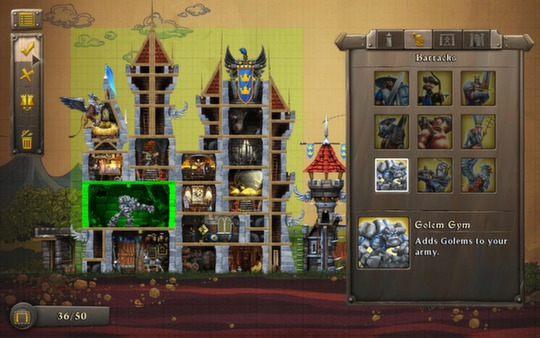
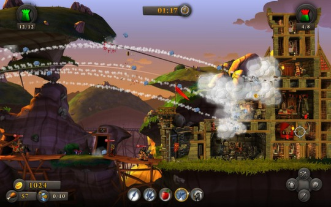
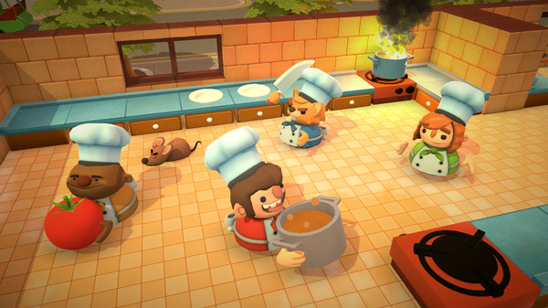
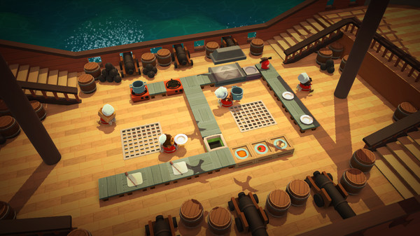
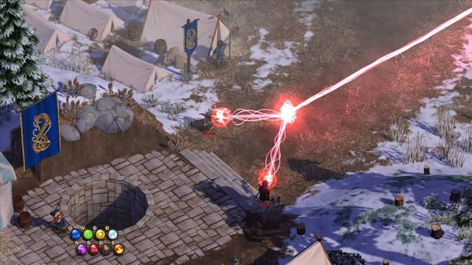
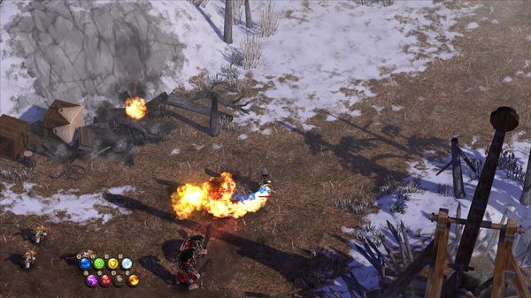
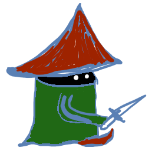

# Mages vs Goblins - Design Document

## Table of Contents

1. [Introduction](#introduction)
    1. [Game Summary](#game-summary)
    2. [Platform](#platform)
    3. [Genre](#genre)
    4. [Inspiration](#inspiration)
        1. [CastleStorm](#castlestorm)
        2. [Overcooked](#overcooked)
        3. [Magicka](#magicka)
    5. [Theme Interpretation (Unusual Magic)](#theme-interpretation-unusual-magic)
    6. [Player Experience](#player-experience)
    7. [Development Software](#development-software)
    8. [Development Team](development_team.md)
2. [Art and Music](#art-and-music)
3. [UI](#ui)
4. [Controls](#controls)
5. [Game Jam Minimal Viable Product](#game-jam-minimal-viable-product)
6. [Other Documents](#other-documents)
    1. [Game concept](game_concept.md)
    2. [Wiki](development_team.md)
        1. [Magic Orbs](wiki/magic_orbs.md)
        2. [Spells](wiki/spells.md)
        3. [Items](wiki/items.md)
        4. [Buildings and Rooms](wiki/buildings.md)

## Introduction

### Game Summary

2.5D multiplayer game where you play as a mage and fight against goblins waves or other players. You start in your own settlement that you need to protect from incoming threats. You can build different building to help you out, collect resource and cast spells to defend your base and to destroy your foes.

### Platform

The game will be developed for PC and will be available on Steam and fully playable on SteamDeck.
Going with simple approach game may be playable on web browser during early stages of development.

### Genre

2.5D multiplayer game with RPG elements, tower defense, some crafting and building mechanics.

### Inspiration

#### CastleStorm

Nice and simple art style with good building design and easy fighting mechanics.

Steam page: <https://store.steampowered.com/app/241410/CastleStorm/>

#### Overcooked

Fun gameplay with constant rush of time where you need to do a lot of thing kinda in the same time. Allowing you to split and change tasks when not playing alone. Also funny simplistic character art style.

Steam page: <https://store.steampowered.com/app/448510/Overcooked/>

#### Magicka

Character art style and spell crafting/casting mechanics and ability to fail them in many fun ways.

Steam page: <https://store.steampowered.com/app/42910/Magicka/>

### Theme Interpretation (Unusual Magic)

As magic on itself is unusual. So the idea is about how it can be done with the main focus on crafting different spells by combining different orbs and other items, aligning them in specific symbol by layers - kinda programming it.

### Player Experience

The player should constantly be defending his base from enemy incoming spell and creature attacks while collecting, crafting, building and casting spells to defend and to attack the enemy and his base. All the tasks can be split between players if playing in multiplayer of with bots.
As crafting spells is the main game mechanic experimenting and learning from success and miserable failures should be the main source of Fun. (Loosing is also Fun).

### Development Software

Primary development software will be Unity 2022.
There are some possibilities to use other engines like PhaseJS or Godot.
For 3D modeling and texturing Blender will be used.
For sketching and concept art Leonardo will be used.

### Development Team

Solo developer with a lot of knowledge about software development, but bad 3d modeling skills and art skills and even worse music skills.

## Art and Music

Best would be have simple 3d building models like in CastleStorm. Building could be damaged and destroyed so will need multiple instances of every building model.
Character models should be like in Overcooked. Low poly and funny and awkward, representing new, out of school mages. Maybe like Final Fantasy 1 Dark mage. Later will have an ability to personalize them with different hats and clothes.

Note that players can have armor, magic shields, weapons and different status effects.
The game will be 2.5D so some models can be 2D sprites.

Music should be simple with magic and medieval vibes to it.
Sound effects needs to be tried randomly as I have no knowledge how to make them. Maybe will try to record on my own or just make "voice affects" for spells.

## UI

Player should be visually seeing what he is currently holding.
In addition there should be HP bars or other visual clues about other player, structure and enemy status.
For charging, and gathering simple progress bars should be enough. But for casting spells some kind of animation or visual effect about the spell should be shown. Like if fire element is in - it burns.
No other special requirements is needed ... yet.

## Controls

As side scrolling game player will have simple controls like WASD and mouse to move and look around and target. Left and Right mouse buttons to pick up and use items. Also Q and E or similar to drop them.

Similar with controller. Left stick to move and right stick to look around and target. Left and Right triggers to pick up and use items and bumpers to drop them.

## Game Jam Minimal Viable Product

Game should have one mode available - Base Defense.
Here player will need just to cast different spells to defend his base from incoming waves of enemies and spells.

From start can not have visual character itself. Player will just be picking and putting desired [Magic Orbs] into slots just by clicking.
Player will be able to order specific orbs from building, but that will require time to appear.

This mode will be mostly used as a playground for testing and experimenting with magic and spells.
So it would be nice to have more different orbs and spells available that to have character.

## Other documents

1. [Game concept](game_concept.md)
2. [Wiki](development_team.md)
    1. [Magic Orbs](wiki/magic_orbs.md)
    2. [Spells](wiki/spells.md)
    3. [Items](wiki/items.md)
    4. [Buildings and Rooms](wiki/buildings.md)
