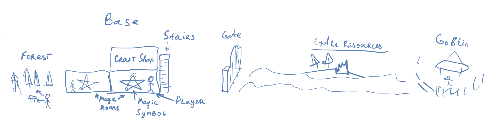
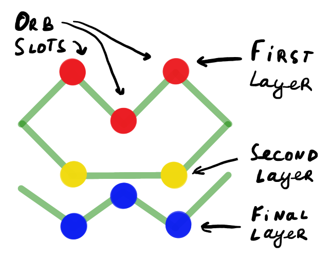

# Game Concept

## Gameplay overview

Player controls a character. He can move around the map and interact with surroundings. Primary goal is to defend the base from incoming attacks.
Player should harvest different resources and bring them to specific production buildings so later he could convert them to other resources, items or build new rooms.
Player inventory is limited and he can only carry a few items at the same time. So he will constantly need to know what he needs and what to do next. It should incentivize player to plan ahead and to split tasks between other players if he is playing in multiplayer or AI if available.
Most important part of the game is to craft different [Magic Orbs](magic_orbs.md). They are used to cast powerful spells.
Spells are the primary way of destroying opponent's base and to defend against incoming spell attacks.

Game is lost when player's throne room is destroyed or when player resurrection altar is destroyed and player is not able to resurrect himself.
Some conditions for winning.
Note that there can be multiple game modes. Like PvP, Base Defense, Campaign, etc.

### Example map

## Primary mechanics

Game core is spell crafting.

### Spell crafting

Spells can be crafted only in specific building/room - Magic room.
To start crafting a spell player needs to choose between starting symbol which will appear in the room. Symbols have different amount of layers for the spell and also may provide different bonuses for the resulting spell and also have different crafting and charging cost.
When symbol is drawn player may put [Magic Orbs] into the symbol slots.
Every symbol layer can have different amount of slots. Not all slots should be filled to cast a spell.
When player is decided on orbs he can start charging the spell.
Spell will be charged by Layers in order defined by [Magic Symbol].
When layer is fully filled - spell is casted. Result of the spell is determined by the [Magic Symbol] and [Magic Orbs] placed in the slots of that layer. Resulting spell is passed to the next layer of this symbol. So the next layer can modify the spell or apply some effect to it. If there is no next layer - spell is fully casted.

### Example

1. Player chooses [Magic Symbol] with 3 layers. First layer has 2 slots, second - 3 and last - 2.
2. Player puts [Magic Orbs] into the first layer:
    1. [Fire Orb] - to apply fire element and do fire damage
    2. [Ball Orb] - to make the spell of a ball shape
3. Player puts [Magic Orbs] into the second layer:
    1. [Sky Orb] - to make spell appear from the sky
    2. [Ball Orb] - to make the spell bigger and more stable, so that spell would not burn before reaching the target.
4. Player puts [Magic Orbs] into the third layer. Note that orb position in this case matters!!!:
    1. [Kinetic Orb] - to apply some starting motion to the spell
    2. [Magic Orb] - Just increase the power of the kinetic motion
    3. [Chaos Orb] - Makes stuff usually explode
5. Player starts charging the spell to full.

When the first layer is fully charged fire ball should appear as indication of the first layer result.
When the second layer is fully charged - fire ball will teleport to the sky and become bigger.
When the third layer is fully charged - the kinetic motion will be applied depending on the position of an orm in the layer. Like right side - right motion, left side - left motion or by other visual symbol indication.
Here spell is considered fully finished and casted. Now player can watch how his Meteor spell is flying to destroy everything in its path.

Note that if player stops charging spell at any moment spell can decay or become unstable.
Like if player stops after charging first layer - fire will just burn out and disappear (with all the orbs used).
After second layer - fire ball will just fall down to the ground. It will be less damaging as it burned out a bit, but still can do some damage considering that it appeared directly over player.

## Secondary mechanics

### Harvesting

There are many different resources on the map on both sides of the player base. Resources between player base and enemy are considered more valuable and harder to harvest, but will allow better crafting, spells and stronger defenses. It should incentivize player to fight for them.

Player inventory is limited by two hands. So player can hold only two small items. Right and Left click respectively. Player can also hold one big item in his hands. Later player will be able to hold one or more addition item in his backpack or deliver items by some other tools.

Resources should be delivered to the production buildings/rooms so the that they could be used later.

### Crafting

There will be multiple crafting buildings/rooms. Each will have different recipes and will produce different items.

Most important crafting building is Magic Workshop. It will be used mostly to craft [Magic Orbs].

Other possibilities are to craft weapons, armor, potions and even siege weapons.

### Building

Building and room can be ordered by sitting on the Throne in the Throne room. After that players will be able to bring resources and slowly build the room.
Rooms and buildings can be damaged by enemy attacks (mostly spells) and destroyed. To repair the room player should bring smaller amount of resources.
Destroyed building/room should be ordered again from the Throne room.

### Fighting

Players can fight each other and creature by weapons and spells.
To use a spell in battle player first needs to craft it and bind it to the weapon. Depending on the weapon it will have different amount of charges and durability.
For example player can have fire wood sword. It will set enemies to fire but won't hold very long.

Note that player can bind spells wrongly. For example simple fire ball spell was applied to the staff giving it a lot of charges, but forgetting to have additional layer of kinetic motion to it. So fireball will just appear where the staff is and mostly always will damage the player.
